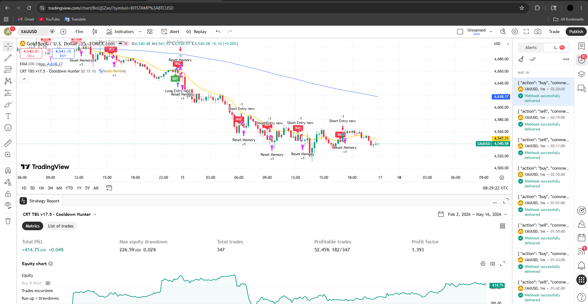

# CRT Trading Bridge — Automated Trading Infrastructure

A production-grade automated trading bridge that connects TradingView alerts
to MetaTrader 5 (MT5) for live trade execution on GOLD (XAUUSD), deployed on AWS EC2.

> This system was deployed live on AWS EC2 and executed real trades automatically.

---

## Tech Stack
- **Strategy:** Pine Script v6 (TradingView)
- **Bridge:** Python 3.12 + FastAPI
- **Broker API:** MetaTrader5 (MT5)
- **Web Server:** Uvicorn
- **Hosting:** AWS EC2 (Windows Server)
- **Security:** python-dotenv (.env based credentials)

---

## System Architecture
TradingView (Pine Script v6)
│
│  Webhook Alert — HTTP POST
│  { "action": "buy", "comment": "Long Entry new" }
▼
FastAPI Bridge — AWS EC2 Windows (port 80)
│
├── Filter housekeeping signals (Reset/Internal → skip)
├── Route signal → correct order type + SL/TP
│
▼
MetaTrader 5 Terminal
│
▼
✅ Live Trade Executed on GOLD (XAUUSD)
---

## Signal Routing Logic

| TradingView Signal | Comment Tag | MT5 Action | SL / TP |
|---|---|---|---|
| BUY | Long Entry new | SELL (fade) | 3.5 / 3.5 |
| SELL | Short Entry new | BUY (fade) | 3.5 / 3.5 |
| BUY | Long Entry | BUY (standard) | 2.0 / 2.5 |
| SELL | Short Entry | SELL (standard) | 2.0 / 2.5 |
| ANY | Reset / Internal | SKIP | — |

---

## Project Structure
trading-bridge/
│
├── app/
│   ├── init.py       ← Python package marker
│   ├── main.py           ← FastAPI app + webhook endpoint
│   ├── trader.py         ← MT5 connection + trade execution
│   └── config.py         ← Loads credentials from .env
│
├── strategies/
│   └── crt_tbs.pine      ← TradingView Pine Script v6
│
├── docs/
│   └── architecture.md   ← Detailed system documentation
│
├── .env.example          ← Credential template (safe to share)
├── requirements.txt      ← Python dependencies
├── run.py                ← Single command entry point
└── README.md             ← You are here
---

## Quick Start

### Prerequisites
- Python 3.10+
- MetaTrader 5 Terminal (Windows only)
- Git

### Run Locally

```bash
# Clone the repository
git clone https://github.com/anurag-devops03/trading-bridge.git
cd trading-bridge

# Create and activate virtual environment
python -m venv venv
source venv/bin/activate  # Windows: venv\Scripts\activate

# Install dependencies
pip install -r requirements.txt

# Setup environment variables
cp .env.example .env
nano .env  # Fill in your real MT5 credentials

# Start the bridge
python run.py
```

---
### Run with Docker

```bash
# Build and start the bridge
docker compose up --build

# Run in background
docker compose up --build -d

# Stop the bridge
docker compose down
```

> **Note:** Docker containerizes the FastAPI bridge only.
> MetaTrader 5 terminal must run separately on Windows.
> The bridge connects to MT5 via the MT5 Python library.

## Webhook Endpoints

| Method | Endpoint | Description |
|---|---|---|
| GET | / | Health check — confirms bridge is online |
| POST | /webhook | Receives TradingView alert payload |

### TradingView Alert Payload

Set your TradingView alert message to:

```json
{
  "action": "{{strategy.order.action}}",
  "comment": "{{strategy.order.comment}}"
}
```

---

## Environment Variables

```bash
# Copy template and fill real values
cp .env.example .env
```

| Variable | Description | Example |
|---|---|---|
| MT5_LOGIN | Your MT5 account number | 12345678 |
| MT5_PASSWORD | Your MT5 password | yourpassword |
| MT5_SERVER | Your broker server name | XMGlobal-MT5 |
| SYMBOL | Trading symbol | GOLD.i# |
| LOT_SIZE | Trade lot size | 0.01 |
| SL_POINTS | Stop loss in points | 2.0 |
| TP_POINTS | Take profit in points | 2.5 |
| PORT | Server port | 80 |

---
## Strategy in Action



> BUY/SELL signals generated by CRT TBS v17.5 Pine Script on GOLD (XAUUSD)

---

## CRT Strategy — How It Works

| Concept | Detail |
|---|---|
| CRT Candle | Body ≥ 50% of total candle range |
| Bull Signal | Sweeps below CRT low → closes back above + above EMA |
| Bear Signal | Sweeps above CRT high → closes back below + below EMA |
| EMA Filter | 15-period EMA confirms trend direction |
| Cooldown | 10 bar wait prevents overtrading |

Full strategy code → [`strategies/crt_tbs.pine`](strategies/crt_tbs.pine)

---

## Detailed Documentation

Full architecture breakdown → [`docs/architecture.md`](docs/architecture.md)

---

## Project Status

- [x] Phase 1 — Project Structure
- [x] Phase 2 — Security Setup (.gitignore + .env)
- [x] Phase 3 — Clean Modular Codebase
- [x] Phase 4 — Dependencies (requirements.txt)
- [x] Phase 5 — Documentation
- [x] Phase 6 — GitHub Deployment
